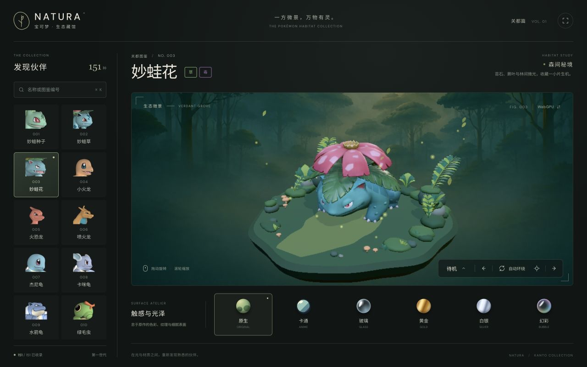
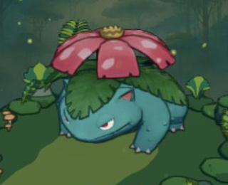
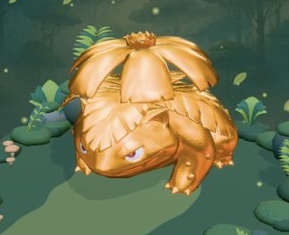
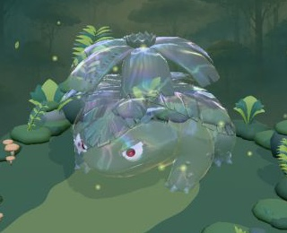

# Living Diorama · 共生之境 · [简体中文](README.zh-CN.md)

A miniature ecology interaction game built with [Hilo3D](https://hilo3d.js.org), React and TypeScript. Twenty Pokémon live on a small coastal island: observe them, gently change their surroundings, and photograph the stories they create together. The application UI is in Chinese. The original 151-species model gallery remains available from the game settings.

[Live demo](https://06wj.github.io/pokemon/)

## Life on the island (P0)

A first visit opens the living world and automatically loads its twenty residents. Use `?scene=ecology` to enter explicitly. Settings lead to the original gallery; `?scene=gallery` and model deep links such as `#003` also open it. An explicit `scene` parameter takes precedence over a preserved model hash.

- **Autonomous daily life:** ripe fruit falls naturally; residents investigate, eat, explore, seek tree shade, sleep and wake. Small, temporary bubbles explain what catches their attention. There is no battle, level grind or missed-feeding penalty.
- **Four core stories:** fruit foraging and eating; Charmander lighting a prepared campfire and attracting companions; Squirtle collecting river water and watering flowers; Pikachu smelling flowers and prompting nearby reactions. Idle, Walk, Run, Attack, Happy and Sleep are composed with movement, timing and effects.
- **Small gestures and local reactions:** fire, water and Pikachu's brief electrical display have inspection, preparation and settling beats. Nearby residents respond according to distance, personality and their current activity. Continuous idle playback, small glances and body adjustments keep these pauses connected.
- **Gentle intervention:** observe (**O**), select fruit throwing (**F**) and click suitable ground, shake the tree, prepare firewood or rustle flowers. Dragging still orbits the camera; a focused canvas accepts **Enter** to throw fruit beside the meadow. Click a resident portrait to follow, then pet it or return to the overview. Photograph the current view with **C** or the shutter button.
- **Time and weather:** choose dawn/dusk and sunny/rain/snow. Snow accumulates gradually and melts after switching to rain or sunshine; weather influences where residents choose to go. Pausing stops accumulation and melting while still allowing weather selection. Restarting keeps the selected weather, clears snow coverage and restarts daily life.
- **Island sounds:** the top-right sound switch remembers its setting. Web Audio starts only after a user gesture, adding quiet footsteps, fruit, leaves, fire, water and electrical sounds with distance and stereo placement. Pausing, opening a journal or hiding the page silences them; resuming does not replay missed sounds.
- **Local keepsakes:** up to 12 JPEG photos retain their visible subjects, associated discoveries, time and weather. A full album or storage error keeps existing photos and offers the new image for download. Species, behavior and moment discoveries use stable IDs across visits; photo Moment labels use the latest real occurrence and its visible participants. Restarting preserves the album and discoveries; dialogs pause the world and support Escape and keyboard focus navigation.

The [design catalog](docs/design/interaction-catalog.md) also contains future ideas. Its twenty scene cards are not a list of fully implemented features: shadow chasing, persistent relationship memory and broader collection systems remain later work.

## Original gallery



- 151 regular-form models and 869 animation clips, loaded on demand as GLB assets.
- Six material presets: Original, Anime (toon), Pixel, Gold, Glaze (original surfaces with clearcoat) and Bubble (iridescent). Pixel uses a fixed pixel grid, four lighting levels, ordered dithering and a limited color palette. Pixel and Glaze retain the `glass` and `silver` URL keys for existing links.
- Six habitat scenes selected by Pokémon type, with environment lighting and particle effects.
- WebGPU and WebGL2 rendering, with a manual backend switch.
- Responsive controls for model selection, animation playback, orbit, zoom and fullscreen.

## Material examples

Venusaur rendered with three presets. These WebGPU captures use the same camera view and are cropped to the model region.

| Anime / Toon | Gold | Bubble / Iridescent |
| --- | --- | --- |
|  |  |  |

Toon and Pixel also stylize the habitat. Both reuse the original pigment/normal/depth pass. Pixel filters nine depth-aware samples per cell on a small render target, with softened lighting thresholds and reduced ordered dithering to limit shimmer. It expands that grid with nearest-neighbor sampling and resolves it again after tone mapping so block edges stay sharp. Desktop blocks are about 4 CSS pixels; narrow viewports keep 2-pixel blocks. Models are scaled to the same idle-pose height, without shrinking wide wings or long tails to fit a width/depth limit. The DOM interface remains at full resolution. Material changes preserve skeletal animation and expression atlases.

## Gallery controls and URL parameters

- Search by displayed name or Pokédex number; select a model from the list.
- Drag to orbit; use the mouse wheel or pinch gesture to zoom.
- Open the action menu to select an available animation. Supported actions are retained when changing models.
- Desktop shortcuts: **← / →** select models, **R** resets the camera, **⌘ / Ctrl + K** focuses search. The action menu supports arrow keys, Enter and Esc.
- Click the **WebGPU / WebGL2** label to switch backends. This reloads the page, preserving the model and material but resetting the camera and action.

Example: [`?backend=webgpu&material=toon#003`](https://06wj.github.io/pokemon/?backend=webgpu&material=toon#003).

| Parameter | Values | Default |
| --- | --- | --- |
| `backend` | `auto`, `webgpu`, `webgl2` | Automatic selection |
| `material` | `original`, `toon`, `glass`, `gold`, `silver`, `iridescent` | `original` |
| `scene` | `ecology`, `gallery` | `ecology` when no explicit model hash is present |
| URL hash | Pokédex number, e.g. `#003`; opens the gallery unless `scene` is explicit | None; the gallery starts at `#001` |

WebGPU support and output depend on the browser and GPU. If rendering is incorrect, try the [living world with WebGL2](https://06wj.github.io/pokemon/?scene=ecology&backend=webgl2) or switch backends inside the gallery. Errors after WebGPU initialization begins are displayed without silently switching backends.

## Implementation

- **Stack:** Hilo3D `2.0.0-alpha.8`, React 19, TypeScript 7 and Vite 8.
- **Application:** `EcologyScene` provides the game UI; `EcologyStageController` owns its assets, camera, clock and capture. `PokemonStageController` continues to serve the original gallery.
- **Living systems:** `src/ecology/livingSimulation.ts` coordinates residents, while `actionComposer.ts` advances action sequences and `livingContent.ts` configures cast, interests and tuning. `livingWeather.ts` owns gradual snow and wetness changes.
- **Presentation and records:** `src/hilo/livingEffects.ts` renders food, fire and interaction effects; `src/hilo/livingWeatherEffects.ts` handles precipitation and snow surfaces. `src/ecology/livingJournal.ts` validates and persists local photos/discoveries, preserving recoverable data on storage failures.
- **Motion and sound:** `src/hilo/livingMotion.ts` adds small body gestures without changing navigation positions. `src/hilo/livingAudio.ts` synthesizes sounds locally, deduplicates action effects, caps footsteps and active sources, and owns audio pause/reset/disposal.
- **Assets:** self-contained GLBs with skeletal animation and embedded textures. Per-mesh joint palettes fit the 128-bone GPU path on WebGL2 and WebGPU.
- **Materials and lighting:** material adapters, HDR environment lighting, toon shading, habitat-specific water and particle effects.
- **Delivery:** eligible opaque color textures use JPEG without reducing resolution. Other PNGs, including normal/data maps and expression textures, retain their original bytes. Models and the WebGPU shader compiler load on demand.

## Asset credits

This is an unofficial technical demonstration, not affiliated with or endorsed by the Pokémon rights holders. Pokémon characters and associated assets belong to their respective owners; this repository does not grant rights to those assets.

- Species and type data: [official Traditional Chinese Pokédex](https://tw.portal-pokemon.com/play/pokedex/).
- Environment lighting: [Poly Haven HDRI credits](public/environments/CREDITS.md).
- Generated backdrops: ImageGen; see [prompts and asset notes](public/backdrops/README.md).

## Development

### Run locally

Use **Node.js 22.18+** for the full toolchain and resource tests. Exported models are included; Blender is only needed when rebuilding assets.

```bash
npm ci
npm run dev
```

```bash
npm run typecheck
npm run test:living
npm run test:ecology
node scripts/test-viewer-location.mjs
node scripts/test-animation-selection.mjs
npm run test:toon
npm run build
npm run preview
```

For focused checks, run `node scripts/test-living-weather.mjs` or `node scripts/test-living-audio.mjs`. The living suite covers daily behavior, local reactions, motion, audio scheduling, records, picking and routes. Check visuals, photo capture and input separately in browser runs for each rendering backend; current verification limits are recorded in [implementation status](docs/design/implementation-status.md).

Builds write `dist/` with relative asset paths for subdirectory hosting. Keep the generated `.wasm` file: the WebGPU shader compiler loads it on demand. Runtime model metadata is trimmed during builds, and production source maps are disabled. Documentation screenshots live outside `public/`, so they do not increase the deployed gallery payload.

The viewer uses Hilo3D `2.0.0-alpha.8` with `shadowUpdateMode: 'full'`, so animated shadow slices refresh completely within the same frame instead of being deferred by the page-update budget.

Toon rendering caches mesh selection and writes pigment plus native surface attributes in one MRT draw. The pigment target uses sRGB 8-bit storage; the painted HDR scene and contour resolution remain unchanged. The adapter composes the public shader sources from the pinned Hilo3D version, so review it when upgrading. Explicit instancing and unsupported raster states retain the separate pigment/normal path. Touch-first devices use 1024px shadows; desktop devices use 2048px.

### Project structure

```text
src/app/          App lifecycle, selection and URL state
src/components/   Game HUD, journal dialogs, gallery and accessible controls
src/content/      Pokémon, habitats, material themes and model manifest
src/ecology/      Living simulation, action recipes, weather, navigation and journal
src/hilo/         Rendering, animation, water, particles and material adapters
public/           Shipped models, habitats, backdrops and environment lighting
scripts/          Blender exports, asset optimization and validation
docs/screenshots/ Browser captures used by these READMEs
```

### Rebuild and verify assets

Supply original Blender files locally in `source/Gen1/`; `source/` is intentionally ignored by Git. With **Blender 5.1**, run from the repository root:

```bash
blender --background --factory-startup --python scripts/export-gen1.py -- --ids 001 003 005
# Export the full collection, or resume an existing export:
blender --background --factory-startup --python scripts/export-gen1.py -- --all --skip-existing
```

Exports preserve skeletal animation and embedded textures, compact per-mesh skin palettes, and update `src/content/animatedModels.json`. Existing models can be compacted with `python3 scripts/gen1_skinning.py --all`. Habitat generation lives in `scripts/create-habitats.py`.

```bash
python3 scripts/test-gen1-skinning.py
npm run models:validate
# Requires Python 3 + Pillow; does not require Blender:
npm run assets:optimize -- --ids 003
# Omit --ids to process all delivery assets.
```

The optimizer converts eligible opaque color maps to JPEG only when they meet error limits and become smaller. It preserves resolution, uses 4:4:4 sampling, leaves other PNGs/icons untouched, and deduplicates identical embedded image payloads without changing materials or geometry. JPEG is lossy: check new assets visually on both backends and on target devices.

Originals are backed up under `source/asset-optimization/originals/`; the [per-file report](scripts/asset-optimization-report.json) records backup paths, sizes and output hashes. Keep a separate copy of these local backups. Matching output hashes are skipped on reruns to prevent repeated lossy compression. Legacy palette-quantized PNGs can be restored with `npm run assets:optimize -- --restore-quantized-pngs` when original backups are available.

### Rebuild the coastal ecology map (v2)

The v2 map uses the following authoring and delivery files:

| Purpose | File |
| --- | --- |
| Editable Blender scene | `assets/ecology-coastal-v2.blend` |
| Runtime landscape | `public/habitats/ecology-coastal-v2.glb` |
| Scene and vegetation generators | `scripts/create-ecology-coastal.py`, `scripts/coastal_flora.py` |
| Shared geometry and navigation layout | `src/ecology/coastalLayout.json` |
| Baked terrain base color for PBR materials | `assets/textures/coastal-terrain-albedo.png` |
| Composition reference | `docs/design/images/coastal-island-map-v2.png` |
| Blender preview outputs | `artifacts/coastal-island-v2-day.png`, `artifacts/coastal-island-v2-dusk.png` |

Use **Blender MCP** to launch a separate background process with Blender's `bpy.app.binary_path`, the repository root as its working directory, and `--background --factory-startup --python scripts/create-ecology-coastal.py`. The generator builds a new scene, imports `coastal_flora.py`, bakes the terrain base color, and writes the editable scene, runtime GLB and day/dusk previews. The existing interactive Blender document remains open; the older `assets/ecology-sanctuary.blend`, ecology sources under `source/`, and `public/habitats/ecology.glb` are retained.

The shared layout defines a sloping beach, a submerged sand shelf, a stream following monotone Hermite control points, and a shallow bay at the southern estuary. The Blender source retains editable geometry and procedural terrain material nodes alongside the baked color map. Interest-point anchors and the shared layout locate fruit trees, fire, flowers and resting places; runtime living systems supply their changing state and interactions.

Use the reference image to compare composition and landmarks after rebuilding. The PNG outputs are Blender renders; check the exported GLB separately in the browser and run the relevant resource and ecology checks for that build.

### Deploy

Set the repository's GitHub Pages source to **GitHub Actions**. The included [workflow](.github/workflows/deploy-pages.yml) builds and publishes pushes to `master`. No application server is required.
