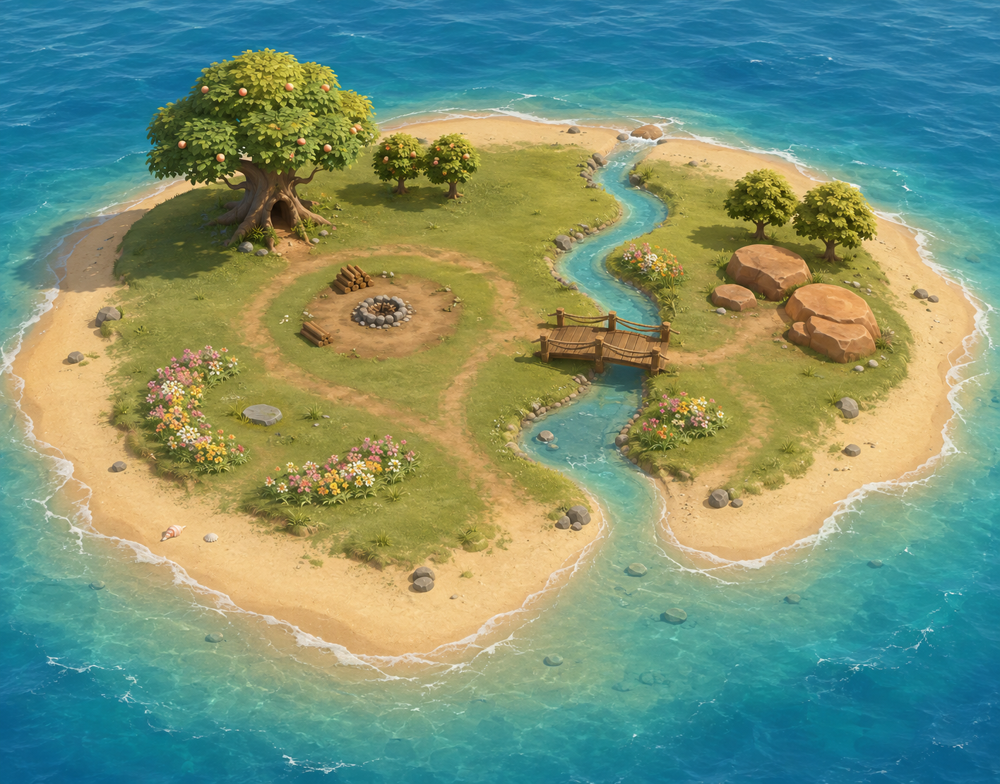

# 海岸生态岛 · 地图重建 v2

日期：2026-09-08。设计依据：微缩生态箱玩法 v0.1，按二十只居民留出空间。

## 造型与空间

外圈由草地连续降到干沙、湿沙和水下沙洲，沙底延伸入海；不使用悬浮底座或木盒边框。岛内保留平缓活动面，连接果树林荫、篝火空地、花野、河边浇花点、木桥与暖岩。溪流两端通过缓坡河口与海面衔接。

本轮重建地形和场景资源。核心活动区总体平缓，南侧河口按参考降低形成浅湾；地面、水面与居民高度使用同一份参数。外圈沙滩与水下沙洲先作为景观，文档中的吃果、点火等完整新玩法另行实现。

## 对照与验证

已用参考视角校准地标坐标，溪流使用穿过参考控制点的平滑 Hermite 曲线；主树、桥、火堆、两处备柴、花床与暖岩均为真实三维几何。地面颜色包含已烘焙的 2048×2048 贴图，GLB 内嵌贴图，不叠乘顶点颜色。Blender 预览采用连成一体的海洋与溪流表面，避免河口双层折射接缝。

已检查日间、黄昏实际渲染、导出对象与贴图打包；生态回归测试、类型检查与构建通过。当前是可编辑的参考复刻，细碎树叶、岩石与地表材质仍有差异，不能称为逐像素一致。网页浏览器视觉验收未完成：本机内置浏览器的本地预览连接返回空白，Chrome 控制器不可用；这不影响已检查的 Blender 原生渲染文件。

## 可复现文件

- 地图与导航共享参数：`src/ecology/coastalLayout.json`。
- Blender 建模脚本：`scripts/create-ecology-coastal.py`，植物模块：`scripts/coastal_flora.py`。
- 可编辑模型：`assets/ecology-coastal-v2.blend`。
- 游戏资源：`public/habitats/ecology-coastal-v2.glb`。
- Blender 渲染：`artifacts/coastal-island-v2-day.png`、`artifacts/coastal-island-v2-dusk.png`。

## Imagegen 提示词

方式：内置 `image_gen`，全新环境设计稿，没有输入或生成宝可梦／宠物形象。保留设计稿作为建模参考；最终模型是独立的 Blender 几何资源。

Use case: stylized-concept. Asset type: environment-only map design reference for rebuilding a real-time 3D cozy creature ecology game in Blender. Create a polished but clearly buildable stylized 3D render concept of a small, low coastal island surrounded by ocean. No creatures, people, text, UI, labels, logos, or existing franchise imagery. Landscape composition about 3:2. Show the ENTIRE island with generous sea margin from an elevated orthographic three-quarter camera around 50 degrees above ground. It must look like actual modular Blender geometry with smooth bevelled forms and simple matte physically based materials, clear shapes and restrained detail, NOT painterly, NOT photographic, no exaggerated micro-foliage, no depth of field. Critical coastline: a continuous broad pale golden sandy beach rings the entire island; dry sand slopes gently through darker wet sand into transparent turquoise shallows, and the sand visibly CONTINUES UNDER the water as a submerged sand shelf before the sea turns deeper blue. No floating platform, no wooden tray, no vertical cliff wall around the rim, no cutaway block, no hard circular ocean boundary. Slightly irregular organic rounded coastline, about 32 metres across by 25 metres deep in game scale. The green inner island is mostly level, spacious, soft moss/sage grass, with low rolling edge transitions, no mountains. Plan it for twenty freely roaming small pets: preserve generous empty grass and connected walking routes, with six readable habitat landmarks. BACK-LEFT: one broad spreading fruit tree with a thick sculpted trunk, an open hollow near its base and a layered rounded canopy bearing a few peach-colored fruits; keep an uncluttered sleeping lawn in its shade and a small pair of shorter fruit trees nearby. MID-LEFT/CENTRE: a circular bare-earth campfire clearing with a small UNLIT stone fire ring, several visible stacked logs and a large empty annulus for three or four creatures to walk around, no fences or benches blocking it. FRONT-LEFT: two restrained crescent beds of low pink, butter-yellow and cream wildflowers with walkable gaps, just enough grass tufts and one flat little resting stone. EASTERN THIRD: a shallow gently sinuous turquoise creek passing from the rear beach to a small sandy estuary at the front, both ends connecting naturally to the surrounding sea; low banks, one accessible shallow drinking spot and a small patch of flowers close enough to the bank to be watered. MIDDLE of that creek: a simple wide low timber footbridge, roughly 4 metres long by 2.5 metres wide, short posts and rails that preserve visibility, connected to both level banks, no stairs. FAR-RIGHT inside the beach: three sun-warmed smooth ochre rocks with flat resting spaces and a modest grove of two small leafy trees. DIRT PATHS: a softly curved loop connects fruit tree shade, campfire clearing, meadow, bridge and warm rocks without splitting the map into fenced zones. Coast details are sparse: a few rounded beach rocks, two or three shells, tiny clumps of dune grass; leave most sand open. Around the island show transparent shallow water over submerged sand, gentle sparse foam at the shore and soft broad waves farther out. Warm bright late-afternoon sunlight from upper left with soft shadows, turquoise and teal sea, pale warm sand, sage green lawn, warm timber, pastel flowers. The scene should make it obvious where eating fruit, sleeping under a tree, gathering by fire, smelling flowers and playing with water could happen even though no animals are drawn. Aim for a clean cohesive high-quality low-to-medium-poly game environment render which can actually be modelled; focus on terrain proportions, shore continuity, clear walkable spaces, topology and landmark composition rather than decorative complexity.
