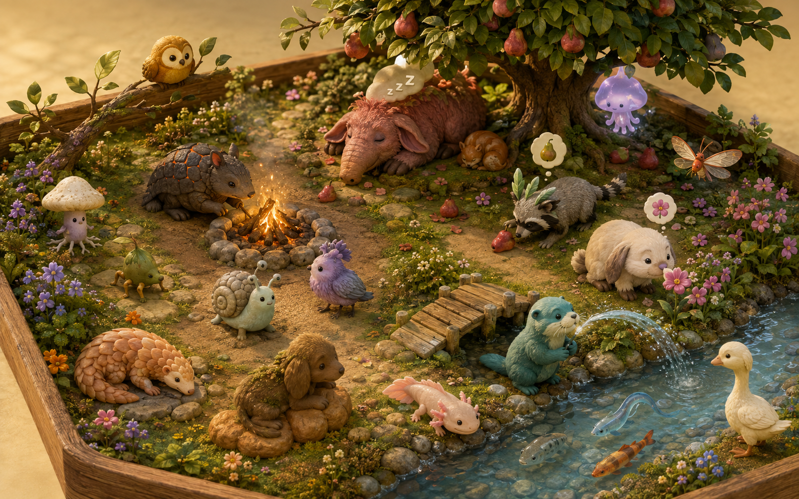
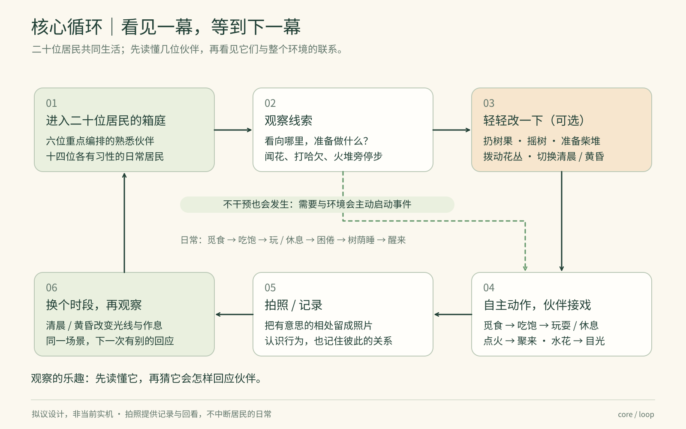
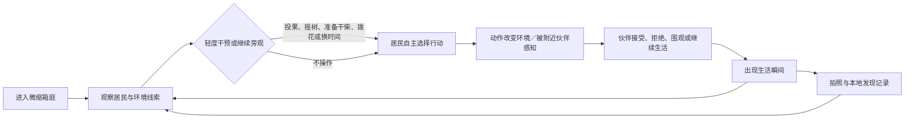
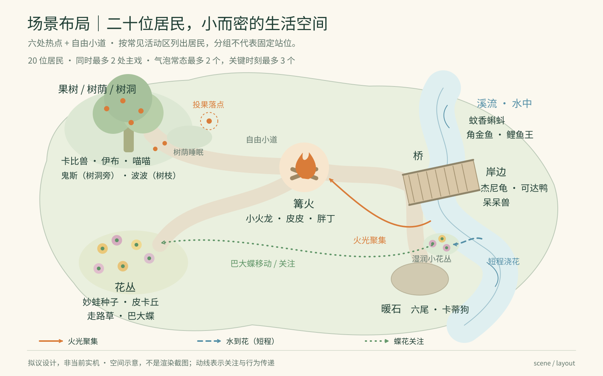
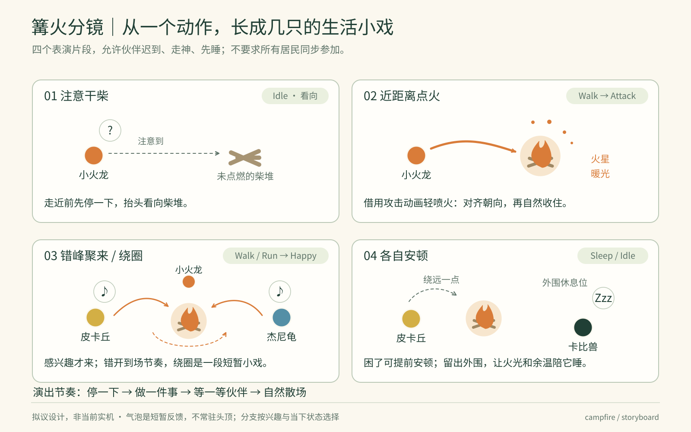
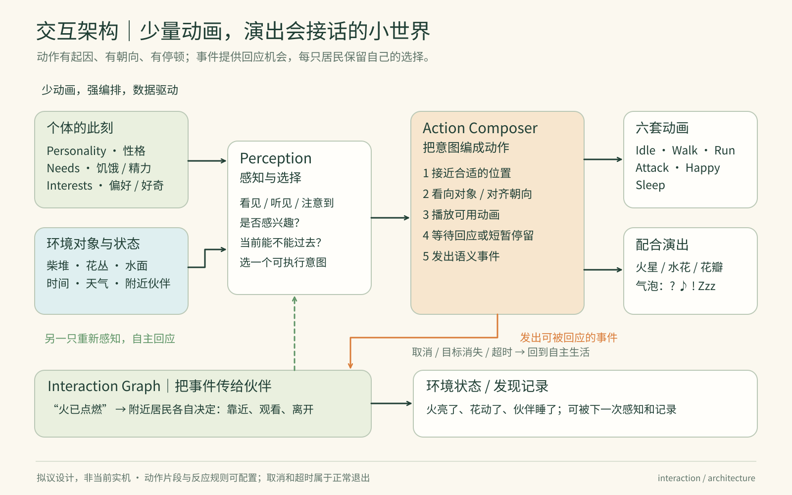
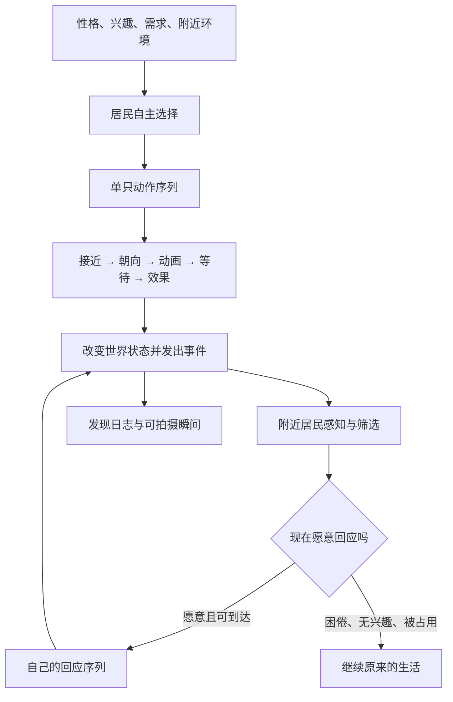

# 共生之境 · 微缩生态箱玩法设计 v0.1

> 设计提案，2026-09-07。本轮交付文档与设计图，不修改玩法代码。现有玩法可以重新设计；本文描述目标体验，不代表功能已经实现或验证。所有距离、时长、数量均为建议起始值，需通过试玩调整。

## 1. 玩家来这里做什么

玩家进入一座微缩箱庭，看二十只宝可梦过自己的小日子。它们会找水果吃、吃饱后玩耍、累了寻找树荫睡觉；这些日常生活是生态的基础。其中六只承担首版重点编排，另外十四只同样拥有觅食、休息与通用回应。小火龙点起篝火，杰尼龟在河里吸水，皮卡丘凑近花朵；一次动作被附近伙伴看见，便接出另一段小戏。玩家可以轻轻改变条件，也可以什么都不做，等一个让人想笑、想拍照的瞬间。

体验重心是 **70% 生态观察，30% 拍照发现**。成长来自“我越来越了解它们”，没有战斗、经验等级、喂养倒计时或离线惩罚。居民不会因为玩家几天没来而受苦。



场景氛围图采用独立原创宠物造型，用于展示 20 只居民的空间与生活氛围；下文角色配置仍映射项目宝可梦。

三个优先原则：

- **先看懂动作，再读懂心情。** 靠近、转头、停顿、水花和气泡要让玩家直接理解因果，日志只补充记录。
- **各过各的生活，也会互相接戏。** 邀请可能被接受、拒绝或忽略；正在睡觉的卡比兽不必参加每场热闹。
- **少动画，强编排。** 已有 Idle、Walk、Run、Attack、Happy、Sleep 六种基础动画；通过移动、朝向、节奏、特效和回应产生新语义。Attack 在这里可表示轻喷火、喷水或喷嚏，不产生伤害。

## 2. 一次五分钟的小旅行

进入时直接看到二十位居民分布在不同热点，不需要先逐个投放。头半分钟用花香、水声、未点燃的木堆等可见线索引导观察；居民自身兴趣也会推动事情发生。二十是场景人口，不是二十只同时表演或二十个气泡：建议同屏最多两段主戏，通常约六至八只明显移动，其余停留观察、休息或睡眠。所有居民始终保有自主状态，安静来自各自选择与错开的节奏，不能为了画面配额突然冻结正在行动的居民。

玩家发现线索 → 等待或轻度干预 → 看见一只行动 → 看见伙伴回应 → 拍下瞬间 → 得到一条发现记录 → 换个位置、时间或观察对象。即使不拍照，世界也继续生活；即使不干预，也应自然出现至少一条连锁。

P0 的干预是能看见结果的小动作：扔一枚水果、摇树落果、在火堆旁准备干柴、轻拨花丛，以及切换清晨／黄昏和拍照。果子的落点、树叶声、新的木柴与花的动静引发环境事件，附近居民自行决定是否看一眼、走近或继续原来的事；绝不传送居民，也不保证演员到齐。时间改变光线、兴趣与困意，不强制全员同时睡觉。放漂叶留到 P1，避免首版控件过多。

每只居民在世界内经历柔和的日常循环：**有点饿 → 寻找合适食物 → 走近吃下 → 满足 → 探索或玩耍 → 疲惫 → 找树荫或安静暖处休息 → 醒来。** 饥饿和困意影响选择，呈现为找寻、放慢脚步和气泡，不是需要玩家清空的告警条。自然落果和环境本身提供生活条件；不投喂也不会失败，离开游戏不累计饥饿债务。

食物、阴影与休息空间是真实的小资源。树冠起始可有三至五枚成熟果实，随时间自然掉落；摇树让现有成熟果先掉下，不能无限复制，枝上空了就只见树叶摇动。成熟过程在游玩中逐步恢复，不要求现实时间等待。地面水果有位置、剩余量和可食类型；光线改变阴影，停留者占用一块实际空间。这些状态留下前后差异，让居民生活连接起来。





## 3. 二十位居民，六位重点编排

以下性格是本游戏的初始创作设定，不是对所有同种宝可梦的定义。首版用鲜明差异让玩家记住个体，后续再加入长期经历造成的变化。

| 居民 | 生活偏好与生态作用 | 容易接出的火花 |
|---|---|---|
| 001 妙蛙种子 | 温和，关注花朵与湿润土壤；喜欢在植物旁休息 | 喜欢杰尼龟适量浇花，但水花太大时会退一步；欢迎巴大蝶，困了则继续睡 |
| 004 小火龙 | 好奇、怕湿；寻找可点燃木堆，带来温暖与光 | 营火招来伙伴；杰尼龟玩水太近时会换到干燥一侧 |
| 007 杰尼龟 | 活泼、喜欢水；从河里吸水，把水带给岸边植物 | 浇花引来草系与巴大蝶；兴奋喷水可能让旁观者惊一下 |
| 025 皮卡丘 | 好奇、爱凑热闹；发现新花、主动邀请伙伴 | 闻花后偶尔喷嚏，巴大蝶躲开、妙蛙种子笑；邀请未被回应就自己玩 |
| 012 巴大蝶 | 轻盈、偏爱开放花朵；沿花丛巡游 | 追随新开的花来到杰尼龟附近，也会避开突然的声音和过热位置 |
| 143 卡比兽 | 慢热、嗜睡；身体与休息位置形成场景重心 | 可以在营火外围打盹，也可以完全不赴约；附近太吵时转身或换处睡 |

目标阵容与初始分区如下。分区是常见落脚处，不是永久禁足范围；水生居民保留合法水域限制，其他居民会沿合适路线串门。十四位次要居民采用通用生活与回应，不要求每只新增一段主戏。

| 初始分区 | 重点居民 | 其余十四位与通用行为 |
|---|---|---|
| 火堆空地 | 004 小火龙 | 037 六尾、058 卡蒂狗：散步、寻找温暖、看向点火者，偶尔赴约后安静离开 |
| 河岸与河道 | 007 杰尼龟 | 054 可达鸭、079 呆呆兽：岸边停留、看水、对水花转头；060 蚊香蝌蚪、118 角金鱼、129 鲤鱼王：水内游弋、停驻、关注水纹 |
| 花丛 | 001 妙蛙种子、012 巴大蝶、025 皮卡丘 | 043 走路草：靠近开放花朵、短暂停留，回应附近喷嚏或开心动静 |
| 大树树荫 | 143 卡比兽 | 035 皮皮、039 胖丁、092 鬼斯：分散休息、林间探索，按作息看热闹或继续安静停留 |
| 桥边 | — | 016 波波：低空巡游、桥头驻足；133 伊布：探索与观察，选择靠近或退让 |
| 暖石 | — | 052 喵喵：晒太阳、慢慢散步，对附近动静转头，再决定是否前往 |

背景居民的最低完整度是“有自己的去处、食物偏好、停留理由和回应选择”。饮食属于本游戏的配置，不把二十只都设成同样爱抢水果：饱足者忽略，困倦者继续睡，害羞者等别人走，目标不可达者另寻去处。水生居民只在合法水域接近配置为可食的漂浮果实，不为一枚岸上水果爬到陆地。睡眠、抬头关注、开心、受惊后退按可用动画与真实位置降级。

## 4. 一张小而密的地图

地图保持一眼能认出主要地标，六个热点靠环形草径连接：火堆、河岸、花丛、大树、桥、暖石。营火、花丛、河岸形成主要观察三角，树荫、暖石和路径边缘提供退场空间。环形草径承担散步、奔跑和绕行，是连接结构，不额外计为第七个热点。二十位居民分散使用各区域，画面同时活跃的小戏控制在两处，避免玩家不知道该看哪里。

| 热点 | 可见物与功能 | 布局要求 |
|---|---|---|
| 营火空地 | 未燃木堆、暖光、环行与休息 | 火堆中心不可穿越，外围有不同体型的停留位 |
| 河道与浅岸 | 流水、吸水点、离水后的站位 | 吸水确实发生在河内；岸边动作有稳定落脚处 |
| 花丛 | 花苞、开放花朵、少量花粉 | 靠近河岸，喷水距离自然；预留两三个观察位置 |
| 大树树荫 | 成熟果实、自然落果、阴影与安静睡眠处 | 取食区与睡位错开，保留不被觅食路线穿过的安静侧 |
| 桥边眺望处 | 偶遇、看水、等待伙伴 | 停留位在桥头侧边，保持桥面通行 |
| 暖石 | 晒太阳、打盹、远看其他居民 | 独立于火堆的安静暖处，有几个错开的停留位 |



## 5. 首版四段主要生活小戏

### A. 一枚水果，让谁先吃

**触发：** 玩家投果、摇树或自然落果后，水果落定并成为附近居民可感知的食物。投掷先呈现短弧线、落地弹动和停住，居民再根据落点与食欲行动；不需要玩家指定食客。

| 镜头中发生什么 | 动画、朝向、特效与气泡 |
|---|---|
| 水果落下，皮卡丘先转头，伊布远远看一眼 | Idle 朝向落点，出现短暂水果／好奇气泡 |
| 饿一些的居民加快脚步，另一只走近又停住 | Walk／Run；双方保持身体间距，等待者看果子再看伙伴 |
| 先到者吃果，或退一步让出位置 | Idle 配轻微节奏变化、咔嚓声、果子可见缺口；礼让使用 Walk 后退再 Idle |
| 果子被吃完，吃饱者开心，慢慢离开 | 水果剩余量递减后移除，Happy → Walk，食欲下降 |
| 等待者改找另一枚，或留下看它一眼 | Idle → Walk；可以出现开心回应，也可以没有回应 |

**分支与收尾：** 皮卡丘很饿时先吃，伊布等了一下便去另一棵树边；皮卡丘已经半饱时，也可能退开让伊布先吃。喵喵路过可以只看热闹，卡比兽睡着就继续睡。玩家第二次投到更安静的位置，害羞的伊布可能这次先来——位置的改变有意义，但没有固定赢家。

**约束与后果：** 每枚果子建议只允许一位进食者、一位近处等待者，其余居民自己选择别的事。必须在真实落点的接触距离内、朝向果子且剩余量大于零才能吃；每次咬口只消耗一次，不能两只同时吃掉同一份，也不能隔空进食。采用 Idle、轻微身体节奏、声音与果子缺口表现吃果，不要求新增 Eat 动画。被打断就释放位置，未吃完的部分留在原处；已吃掉的部分不回滚。满足后自然降低食欲约 45—90 秒，投更多也不全员重聚。世界内散落水果建议上限六枚；超过时暂不新增，避免铺满地面。未被取食的果实逐渐淡化回归环境，没有扣分或清理任务。

### B. 小火龙点起篝火

**触发：** 木堆未燃，小火龙不在睡眠或另一段动作中，且能走到点火位。清晨也有兴趣，黄昏权重更高；第一次进入可增加新鲜感，保证早期有发现机会，但不定时强制播放。

| 镜头中发生什么 | 动画、朝向、特效与气泡 |
|---|---|
| 小火龙发现木堆，走近后停半拍 | Walk → Idle，面朝木堆，短暂“好奇”气泡 |
| 轻喷一口火，木堆真正亮起来 | Attack；嘴前短火苗朝木堆；确认近距离后出现点燃效果 |
| 它退到外围，看看有没有伙伴过来 | Walk → Happy，转向来路，暖色光开始影响地面 |
| 一两只伙伴先转头，再走来 | Idle → Walk；个别显示“温暖”或“开心”，也有居民继续原事 |
| 伙伴在外围慢慢绕行，停下开心或困了睡 | Walk／Happy／Sleep；朝向随行走切线与伙伴变化，睡位更靠外 |

**分支与收尾：** 皮卡丘可能快乐绕圈，妙蛙种子只停留片刻，卡比兽走到外围就睡着；也可能只有一位访客，小火龙仍满足地停在暖光里。晴朗清晨更偏玩耍，黄昏更偏安静聚集。

**约束与后果：** 点火前距离建议不超过 1.8u，并面向木堆；u 为统一场景设计单位，实际阈值需结合体型。营火最多四位参与者，包含点火者；接近位、环行路径、睡位互相留空，任何路线都绕开火心。点火失败或寻路受阻就退出；途中被摸摸会中断个人动作，已经点燃的火仍保留。火光建议持续 90—150 秒并逐渐变弱，居民各自停留 8—25 秒；同一居民再次赴约冷却约 45 秒。



### C. 杰尼龟给花丛带来一点水

**触发：** 花丛偏干或尚未充分开放，杰尼龟对水有兴趣且可抵达取水处。先取水再喷花，不能凭空反复发射。

| 镜头中发生什么 | 动画、朝向、特效与气泡 |
|---|---|
| 杰尼龟进入浅河，低头停一会儿 | Walk → Idle，朝水面，轻微涟漪与“水滴”气泡表示吸水 |
| 它上岸，调整位置对准花丛 | Walk → Idle，水滴气泡短暂保留，抵达后再转头 |
| 吐出一道短水流，花朵抖动并舒展 | Attack；splash 从嘴边飞向花丛，落点出现细水花 |
| 妙蛙种子或巴大蝶注意到变化，来到花边 | Walk／Happy；朝向新开的花，再回头看杰尼龟 |

**分支与收尾：** 妙蛙种子先到，像在检查浇水成果；巴大蝶也可能先绕花飞一圈。皮卡丘若在附近，可以开心凑近，或被一滴水惊得停住；杰尼龟歪向旁边看看，最后自己也开心起来。

**约束与后果：** 取水效果必须发生在合法水域且靠近吸水点；喷花必须到达岸边、面向目标且处于约 2—3u 的射程内。水量是该段动作的一次性资格，不是养成资源；成功喷出、超时或中断后清除。花丛湿润与开放度上升，随后缓慢回落；水花只发生一次，来访者不再自动生成新喷水事件。建议完整动作 15—35 秒，重复冷却 60 秒。

### D. 花香、喷嚏和一阵小惊讶

**触发：** 花丛开放，皮卡丘有探索兴趣，附近有可站立位置；无需伙伴在场才能开始。

| 镜头中发生什么 | 动画、朝向、特效与气泡 |
|---|---|
| 皮卡丘绕到花边，鼻尖对着花停下 | Walk → Idle，花朵轻摆，出现“花”气泡 |
| 闻了一会儿，开心；有时鼻子像有点痒 | Happy，或 Idle 停顿后短暂“好奇” |
| 偶尔打一个喷嚏，花粉飞起 | Attack，少量 pollen 朝前散开，喷嚏瞬间出现“！” |
| 附近伙伴转头，退半步或开心回应 | Idle／Walk／Happy；巴大蝶避开花粉，妙蛙种子可开心回应 |

**分支与收尾：** 喷嚏建议约三次闻花出现一次，其他时候只安静欣赏。巴大蝶闪到旁边，皮卡丘看向它，两个气泡先后冒出“！”与“开心”；若附近没人，皮卡丘甩掉花粉后仍能自己高兴一下。

**约束与后果：** 闻花要实际贴近花丛边缘，喷嚏不能隔河触发。声音／花粉影响附近约 3.5u，通常只引出一两位回应；不会惊醒全地图。花粉视觉存在 1—2 秒，回应窗口约 5 秒，同一对象只回应一次；闻花冷却 35—50 秒。被打断则取消尚未发生的喷嚏，已散出的花粉自然消失。

### P0 日常：树荫下的午觉

吃饱不一定立即睡，玩累也不必等天黑。困意先通过放慢脚步、停顿和短暂“困了”气泡表现；居民根据当前阴影、安静程度、可用空间和附近伙伴选择睡位，走到树荫或安静暖处再进入 Sleep。睡眠独立发生，不依赖篝火小戏。卡比兽偏爱宽敞位置，妙蛙种子倾向花树旁，伊布可能靠近安静伙伴，但不会所有居民挤成一堆。

轻微脚步、水声或远处喷嚏只让睡者轻微转向、短暂冒气泡，随后继续睡；强烈且足够近的动静才会让它醒来、看看来源，再决定换位置还是加入热闹。每只的容忍度不同，同一次声响可能让卡比兽继续打呼、让伊布先抬头。醒来用 Sleep → Idle → Happy 表示舒展，不要求额外起身动画。睡位随离开释放，熟睡者不能被来客直接挤走；路过者减速绕行，让安静本身成为可观察的互动。

## 6. 气泡、拍照与发现

气泡是短暂心情，不是任务说明。发现事物时用“？”或对象图标，投入时用水滴／花，交流时用音符／心，被打断时短促出现“！”，困意则从小小的“Z”渐变成“Zzz”；温暖与开心也有对应图形。出现和消失带轻微缩放、上浮与淡出，持续建议 1.5—3 秒。平时最多两只、关键连锁最多三只同时显示；优先级为新发现／突发 > 互动 > 常态，远处低优先级气泡延后或省略。二十位居民也只共享这份画面额度，不让全部居民常驻气泡，不堆完整句子。

拍照是玩家表达“这一刻我想留下”。P0 提供取景、快门、照片预览和本地保存；快门不打断居民动作。照片可附简短标题、时间、参与者与发现标签，例如“这次让你先吃”“树荫下的午觉”“第一簇火光”“给花的一口水”“被喷嚏吓一跳”。发现日志记录真实发生的事件，照片关联当时画面中的可见主体，不能把画外角色也算进合影。

第一回记录给出温和的“新发现”，重复照片仍可收藏。首版不打构图分，不要求每日打卡；P1 再添加分享卡片，P2 才考虑多维评分与完整图鉴。错过一次不会造成永久缺失，同类瞬间以后还会在不同组合下出现。

## 7. 如何用六种动画接出生活

编排分成两层：**单只的动作顺序可控，多只的故事结局开放。** 小火龙必须先走近再点火，这是可信的动作；谁来围观、停多久、是否睡着，则由各自位置、兴趣、困意和当前活动决定。

每只居民具有稳定性格、当前兴趣与短期需求；感知只读取附近看得见／听得见的变化。营火这种持续环境状态可被后来者发现，喷嚏这种瞬时事件过期便结束。首版不要求复杂关系数值，先保证“它看见了什么，为什么这么做”可读。





事件需要带唯一编号、来源、地点、目标、发生时间、有效期与因果编号。建议火光感知 8—10u、花开 6u、喷嚏 3.5u；距离之外不响应。一次事件对每只居民只结算一次，同一因果链只允许少量后续回应，且不能把“开心回应”再次当成原始喷嚏或点火。短事件过期释放，临时预约有超时，保留日志也不保留无限运行对象。

单只序列随时可能因为主动互动、目标消失、不可达或总时长超限而取消；取消要释放站位、清空待发效果，恢复自主选择。食物消耗需验证同一果实的剩余量与进食归属，吃完、过期或被移除立即解除等待，不能重复结算咬口。移除居民同时解除别人对它的等待；已经形成的环境后果可以自然延续。清空／重新开始则一并重置居民、水果、树上成熟量、睡位、火光、花状态、临时事件和预约；已收藏照片、发现记录保留，除非玩家明确清除收藏。

以下是伪配置，参数为建议值，不是实际源代码：

```yaml
id: kindle_campfire
trigger:
  resident: "004"
  conditions: [campfire_unlit, awake, reachable, not_busy]
  interest: { dawn: 0.65, dusk: 0.95 }
  cooldown_seconds: 60
steps:
  - { id: approach, action: move, target: fire_side_slot, animation: walk }
  - { id: face, action: face, target: campfire, wait_seconds: 0.6 }
  - id: kindle
    animation: attack
    bubble: warm
    duration_seconds: 1.8
    effect: { type: ignite, at_progress: 0.45, once: true }
    require: { distance_max: 1.8, facing_target: true }
  - { id: step_back, action: move, target: outer_slot, animation: walk }
  - { id: enjoy, animation: happy, wait_seconds: 2 }
on_effect: { event: fire_lit, radius: 10, ttl_seconds: 12 }
on_end: { event: resident_settled, ttl_seconds: 3 }
interrupt: [player_pet, target_removed, unreachable, timeout_45_seconds]
fallback:
  attack: [happy, idle]
  happy: [idle]
  sleep: [idle]
  run: [walk, static_pose]
  walk: [run, static_pose]
  when_no_locomotion: nearby_stationary_response_only
  unreachable_distant_action: cancel_and_release_slot
  missing_animation_blocks_action: false
```

动画选择与动作语义分开：没有 Attack 时仍可用 Idle 配合朝向和特效完成喷水；没有 Sleep 时用安静 Idle、关闭移动并显示困倦气泡表示休息。缺少 Walk 时先用 Run，并使行进速度与步态匹配；Walk 和 Run 都缺失时只参与附近的站立回应，放弃需要远行的目标并释放预约，不能让 Idle 模型滑行。备用列表只检查实际存在的片段，不在 Walk／Run 之间递归查找。任何缺片段都不能让动作、状态或事件永久等候；Idle 也缺失时保留模型静止姿态。

## 8. 日常组合与后续小戏

日常与扩展场景的完整卡片见 [生活小戏目录](interaction-catalog.md)，每张按起因、可见动作、接戏分支、环境变化与动画复用展开，标明 P0 日常／P0 主戏／P1 扩展。

1. **影子追逐（P1）：** 皮卡丘追巴大蝶的影子，两只绕到卡比兽旁边时一起放慢速度。
2. **呼噜合奏（P1）：** 杰尼龟在卡比兽呼噜间隙叫一声；卡比兽醒来时，音符气泡立刻收起。
3. **同伴午睡（P0 日常）：** 妙蛙种子先睡，已经有些困的杰尼龟也停下，最后各占一块空地睡。
4. **借一点干燥（P1）：** 雨后巴大蝶靠近小火龙晾翅，暖和后飞走，又回头绕一小圈。
5. **桥头让路（P1）：** 皮卡丘与杰尼龟迎面停下，先后退让；通路空出后分别开心回应。
6. **追错了落叶（P1）：** 一片叶子飘走，两只追到不同方向，再停下互相看，头顶同时冒问号。
7. **树荫搬家（P1）：** 卡比兽换位置睡，妙蛙种子发现原先的阴影没了，慢慢挪到另一侧。
8. **水边倒影（P1）：** 皮卡丘看倒影，巴大蝶掠过水面打散影子；它先惊讶，再追着水纹看。

## 9. 实施范围与验证

| 阶段 | 明确交付 |
|---|---|
| P0 | 一张地图、二十只居民同时在场的目标；六只重点编排水果觅食／篝火／吸水喷水／闻花四段主戏，十四只参与通用回应；所有居民都有按配置运行的觅食、进食、满足、探索、疲惫、睡眠、醒来日常；有限自然落果、摇树与投果、树荫睡位、清晨／黄昏、动态气泡、基础拍照、本地发现日志 |
| P1 | 雨天、放漂叶、两三个可放设施、个体关系记忆、更多生活小戏、照片分享卡片；已有经历开始改变下次回应 |
| P2 | 扩大居民与地图数量、完整物种／行为／关系／Moment 图鉴、经过验证的照片评分 |

MVP 用五分钟短试玩验证，而非以动画种类或互动次数验收。建议观察：

- 玩家能不看日志说清至少一段“谁做了什么，所以谁过来了”的因果。
- 相同热点在不同状态下出现至少两种合理分支，包含一只居民不回应的情况。
- 完全无输入时至少自发出现一条连锁，包含自然落果或自行寻找休息处；首三分钟争取可见觅食与另一段小戏，四种主戏逐步遇到，不为赶节目表强制全场出演。
- 二十位居民同时在场时都有合法的生活状态；注意力集中于一两处小戏，外围仍有安静变化，没有为了限制同时移动数量而强制冻结居民。
- 投果后至少出现“靠近吃果”与“忽略／等待／礼让”两种选择；水果按真实位置和剩余量消耗，吃饱后离开，不隔空进食，也不召集全部二十只。
- 点火、取水、喷花都在真实空间条件满足后发生；围圈不穿火、居民不重叠或无限等待；疲惫者可独立去树荫睡，轻噪音与近处强噪音的回应不同。
- 暂停不推进动作，移除、打断和重置不会留下幽灵气泡、重复效果或被遗忘的等待对象。
- 移除 Sleep 或其他动画片段后，小戏仍能结束并恢复生活；缺片段降级明确可见，不产生卡死。

这些是后续实现与试玩的验收目标，当前文档不宣称上述功能已完成或测试通过。
